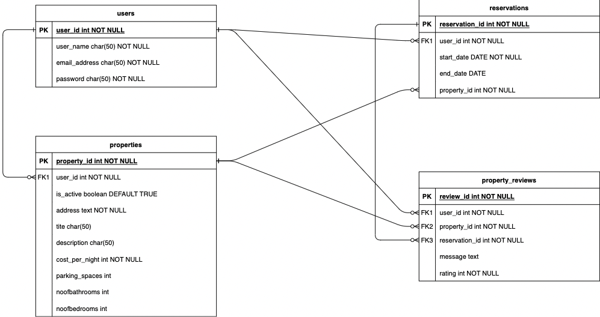
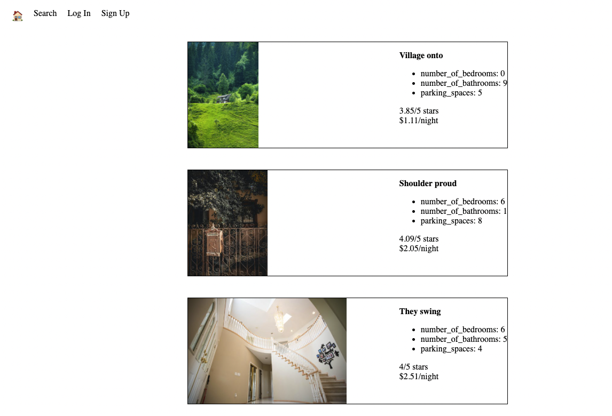

# Lightbnb Project

Create a database of properties, owners and property reviews and use server-side JavaScript to display the information from queries to web pages

## Getting Started

1. Clone this repository onto your local device.
2. Enter the folder `cd LightBnb_WebApp_master`
3. Install dependencies using the `npm install` command.
3. Start the web server using the `npm run local` command. The app will be served at <http://localhost:3000/>.
4. Go to <http://localhost:3000/> in your browser.
5. Creating and loading a database might be required as per below steps:
  - `cd ..` to go back to the folder LightBnB
  - Run `psql` in your terminal
  - `CREATE DATABASE lightbnb;`
  - `\c - labber` (if labber profile is present)
  - `\c lightbnb`
  - `\i seeds/05_seeds.sql;`

## ERD Diagram for Lightbnb PostgreSQL Database

## Lightbnb Screenshot

## Dependencies

- Express
- Node 5.10.x or above
- PostgreSQL (psql (9.5.5)) or above